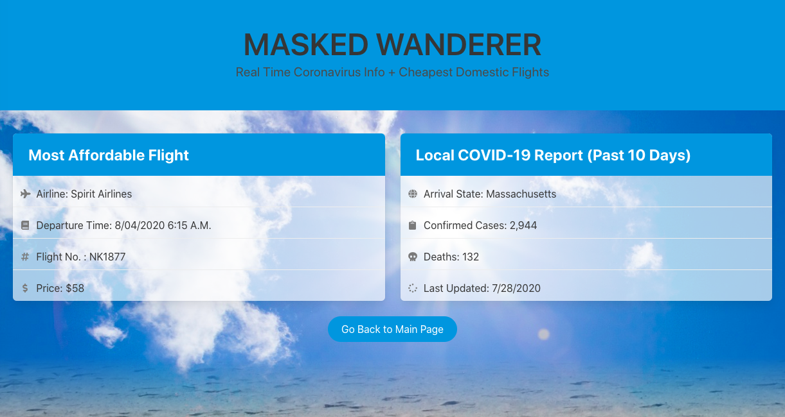

# Masked Wanderer

## Project description

Masked Wanderer is a domestic travel app that helps travelers make informed decisions on where to travel by providing them with COVID-19 data, and the cheapest flight to their desired destination.

### User story

As a traveler, 
I WANT to search flight deals as well as covid information pertaining to a desired destination,
SO THAT I can find the best travel deals and be informed on what is happening at my desired destination. 
GIVEN I am accessing the destination search page, 
WHEN I enter my start and end destination into the search, 
THEN I am provided with the cheapest flight and coronavirus data for the end destination.

### APIs used

[Flight Data API](https://rapidapi.com/Travelpayouts/api/flight-data)

[COVID-19 API](https://rapidapi.com/astsiatsko/api/coronavirus-monitor-v2)

### Website Link

https://nataliegarcia-8.github.io/Domestic-Covid19-TravelApp/

### Screenshots

